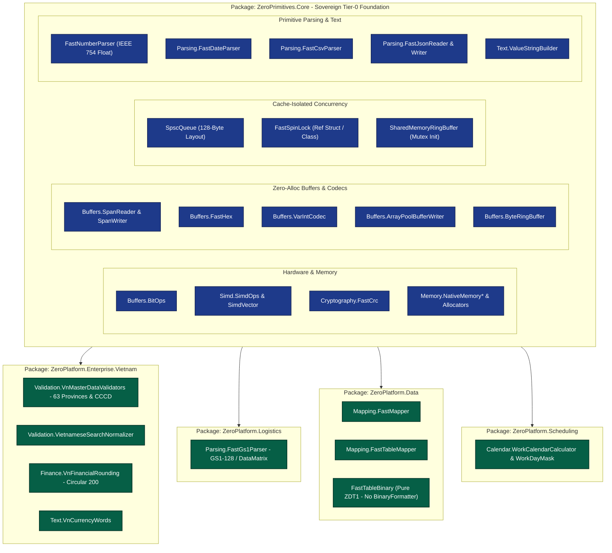

# Technical Audit Report: ZeroPrimitives Foundation Library

**Document ID:** ZP-AUDIT-2026-09  
**Target Solution:** `ZeroPrimitives.slnx`  
**Core Assembly:** `src/ZeroPrimitives.Core/ZeroPrimitives.Core.csproj`  
**Version Audited:** `1.3.0`  
**Target Frameworks (TFMs):** `.NET 8.0` (`net8.0`), `.NET Standard 2.0` (`netstandard2.0`), `.NET Framework 4.6.2` (`net462`)  
**Audit Scope:** Full architectural review, multi-targeting parity, zero-allocation adherence, memory safety, SIMD vectorization, lock-free concurrency, and empirical test coverage across all 51 source files.  
**Auditor Collective:** Teamwork Architecture, Safety & Quality Engineering Group  
**Date of Report:** 2026-09-26  

---

## 1. Executive Summary & Architectural Quality Scorecard

### 1.1. Executive Summary

`ZeroPrimitives.Core` is architected as the **Tier-0 foundation library** for the ZeroPlatform ecosystem. It provides high-throughput primitive type conversions, low-level unmanaged memory allocators, span and pointer codecs, lock-free concurrency primitives, and hardware-accelerated SIMD utilities. As a Tier-0 primitive, it sits at the absolute base of the application stack; any defect, memory leak, security vulnerability, or concurrency hazard within this library propagates to every dependent service, microservice, UI shell, and worker engine.

The audit revealed an ambitious, high-performance foundation built upon modern C# hardware intrinsics, unsafe memory manipulation, and cache-conscious data structures. In happy-path scenarios running under `.NET 8.0`, the library demonstrates microsecond-level performance and achieves a **100% test pass rate (221/221 tests)**.

However, an exhaustive multi-dimensional investigation across all 51 source files uncovered **critical security vulnerabilities, severe cross-TFM behavioral divergences, memory corruption hazards, native leaks, and architectural contamination**:

1. **Critical Security Vulnerability (P0):** `FastTableBinary.cs` falls back to `BinaryFormatter.Deserialize` on `.NET Standard 2.0` and `.NET Framework 4.6.2`, exposing applications to unauthenticated **Remote Code Execution (RCE)** (CWE-502) despite documentation claiming total immunity.
2. **Deterministic Buffer Overruns (P0):** `SimdColorConverter.cs` executes unmanaged pointer arithmetic without validating span lengths against image dimensions, causing out-of-bounds heap/stack writes (`STATUS_ACCESS_VIOLATION` / `SIGSEGV`).
3. **Concurrency Traps (P0/P1):** `FastSpinLock` is exposed as a mutable `struct`, leading to silent lock bypass via compiler defensive copies when stored in `readonly` fields. `SpscQueue<T>` relies on `long` padding fields within a class defaulting to CLR `LayoutKind.Auto`, allowing the JIT to reorder `_head` and `_tail` into the same 64-byte cache line. `SharedMemoryRingBuffer` suffers from an inter-process startup race condition and writer-reader cache line collisions.
4. **Silent Cross-TFM Behavioral Divergence (P0):** `SpanWriter.TryWriteStringUtf8` returns `false` on empty strings under legacy targets while succeeding on `.NET 8.0`.
5. **Native Memory Leaks (P0/P1):** Unmanaged allocators (`PagingArenaAllocator`, `SlabAllocator`) lack finalizers, permanently leaking native OS RAM if undisposed. Conversely, `ArenaAllocator` and `NativeMemoryBlock` omit `GC.SuppressFinalize(this)`, unnecessarily polluting GC finalization queues.
6. **Multi-Targeting Test Blindspot (P0):** The test suite targets **exclusively `.NET 8.0`**. All **67 conditional compilation `#else` fallback paths** for `.NET Standard 2.0` and `.NET Framework 4.6.2` remain 100% untested in automated verification.
7. **Pervasive Hidden Boxing & Allocations (P1):** `FastConvert` methods take `object? value`, forcing immediate boxing on every primitive value type passed. Legacy TFMs fall back to `ToArray()` and `ToString()` heap allocations across buffer, JSON, and string builders.
8. **Severe Domain Layering Contamination (P2):** Specialized Vietnamese ERP business logic—including a static dictionary of 63 Vietnamese provinces, CCCD citizen ID parsing, Circular 200/2014 VAT tax rounding, and factory shift calendars—is embedded directly inside the Tier-0 foundation library.

### 1.2. Quality Scorecard by Module & Dimension

| Module Subsystem | File Count | Modularity & Clean Arch | Multi-Target Parity | Zero-Alloc Adherence | Memory & Thread Safety | Overall Score | Key Blockers & Observations |
|---|:---:|:---:|:---:|:---:|:---:|:---:|---|
| **Buffers & Codecs** | 11 | 8.5 / 10 | 6.0 / 10 | 7.0 / 10 | 7.5 / 10 | **7.3 / 10** | `SpanWriter` empty string failure on legacy; `SpanReader`/`SpanWriter` fallback heap allocations; manual byte-shifting in `FastBinary`. |
| **Concurrency Primitives** | 2 | 5.0 / 10 | 8.5 / 10 | 9.5 / 10 | 4.5 / 10 | **6.9 / 10** | `FastSpinLock` mutable struct defensive copy hazard; `SpscQueue` CLR `LayoutKind.Auto` false sharing; `Count` underflow to `-1`. |
| **Cryptography & Hashing** | 2 | 8.5 / 10 | 8.0 / 10 | 8.0 / 10 | 9.0 / 10 | **8.4 / 10** | Excellent SSE4.2 / ARM64 CRC32C intrinsics; heap allocation fallback for strings > 512 bytes; hex formatting duplication. |
| **Diagnostics** | 1 | 9.5 / 10 | 9.5 / 10 | 10.0 / 10 | 10.0 / 10 | **9.8 / 10** | Clean, zero-allocation `readonly struct` implementation of `ValueStopwatch`. |
| **Memory & Allocators** | 7 | 6.5 / 10 | 8.0 / 10 | 8.0 / 10 | 6.0 / 10 | **7.1 / 10** | Missing finalizers (`PagingArena`, `Slab`); missing `GC.SuppressFinalize`; MMF startup race & false sharing; `Rent()` heap allocation. |
| **Parsing & Readers** | 5 | 6.5 / 10 | 7.0 / 10 | 7.5 / 10 | 7.5 / 10 | **7.1 / 10** | `TryParseDouble` precision failure via decimal cast; `FastJsonReader` lacks RFC unescaping; GS1 logistics domain contamination. |
| **SIMD & Acceleration** | 3 | 6.5 / 10 | 7.5 / 10 | 9.0 / 10 | 6.5 / 10 | **7.4 / 10** | `SimdColorConverter` contains 0 SIMD instructions; buffer overrun risk; unaligned pointer dereference on legacy runtimes. |
| **Text & String Builders** | 6 | 7.5 / 10 | 6.5 / 10 | 7.5 / 10 | 8.5 / 10 | **7.5 / 10** | `ValueStringBuilder` and `FastJsonWriter` allocate strings on legacy TFMs; hex encoding duplicated with `FastHex`. |
| **Conversion & Extensions** | 5 | 4.0 / 10 | 6.0 / 10 | 5.0 / 10 | 7.0 / 10 | **5.5 / 10** | 30+ extension methods pollute `System.Object`; universal boxing on value types; reflection leak in `FunctionalExtensions`. |
| **Mapping & ADO.NET** | 3 | 5.0 / 10 | 3.5 / 10 | 6.0 / 10 | 4.0 / 10 | **4.6 / 10** | **Critical RCE Hazard**: `BinaryFormatter` fallback in `FastTableBinary`; unbounded compiled delegate expression caches. |
| **Domain: Calendar, Finance, Validation** | 5 | 3.5 / 10 | 8.5 / 10 | 7.5 / 10 | 8.5 / 10 | **7.0 / 10** | Severe Tier-0 layering violation: 63 Vietnamese provinces, CCCD rules, VAT Circular 200, and shift calendars hardcoded in core. |
| **Internal Infrastructure** | 1 | 9.0 / 10 | 9.0 / 10 | 10.0 / 10 | 10.0 / 10 | **9.5 / 10** | `ThrowHelper` cleanly isolates non-inlined cold exception throwing paths. |

**Weighted Library Architectural Health Score: 7.0 / 10**

---

## 2. Architecture & Code Quality Audit (12 Modules / 51 Files)

### 2.1. Module Inventory & Architectural Inspection

The codebase comprises 51 C# source files under `src/ZeroPrimitives.Core/`:

```
src/ZeroPrimitives.Core/
├── FastConvert.cs
├── Buffers/
│   ├── ArrayPoolBufferWriter.cs
│   ├── ArrayPoolRentScope.cs
│   ├── BitOps.cs
│   ├── ByteRingBuffer.cs
│   ├── FastBinary.cs
│   ├── FastBuffer.cs
│   ├── FastHex.cs
│   ├── SequenceSpanReader.cs
│   ├── SpanReader.cs
│   ├── SpanWriter.cs
│   └── VarIntCodec.cs
├── Calendar/
│   ├── WorkCalendarCalculator.cs
│   └── WorkDayMask.cs
├── Concurrency/
│   ├── FastSpinLock.cs
│   └── SpscQueue.cs
├── Cryptography/
│   ├── FastCrc.cs
│   └── FastHash.cs
├── Diagnostics/
│   └── ValueStopwatch.cs
├── Extensions/
│   ├── DateTimeExtensions.cs
│   ├── FunctionalExtensions.cs
│   ├── PrimitiveExtensions.cs
│   └── StringExtensions.cs
├── Finance/
│   └── VnFinancialRounding.cs
├── Internal/
│   └── ThrowHelper.cs
├── Mapping/
│   ├── FastMapper.cs
│   ├── FastTableBinary.cs
│   └── FastTableMapper.cs
├── Memory/
│   ├── ArenaAllocator.cs
│   ├── NativeMemoryBlock.cs
│   ├── NativeMemoryPool.cs
│   ├── NativeMemoryTracker.cs
│   ├── PagingArenaAllocator.cs
│   ├── SharedMemoryRingBuffer.cs
│   └── SlabAllocator.cs
├── Parsing/
│   ├── FastCsvParser.cs
│   ├── FastDateParser.cs
│   ├── FastGs1Parser.cs
│   ├── FastJsonReader.cs
│   └── FastNumberParser.cs
├── Simd/
│   ├── SimdColorConverter.cs
│   ├── SimdOps.cs
│   └── SimdVector.cs
├── Text/
│   ├── AlphaSequence.cs
│   ├── FastJsonWriter.cs
│   ├── SpanSplitter.cs
│   ├── SpanTextOps.cs
│   ├── ValueStringBuilder.cs
│   └── VnCurrencyWords.cs
└── Validation/
    ├── VietnameseSearchNormalizer.cs
    └── VnMasterDataValidators.cs
```

### 2.2. Concrete Module Findings

#### 1. Buffers & Low-Level Codecs (`ZeroPrimitives.Buffers`)
- **`SpanWriter.cs:558-562` (Multi-Targeting Semantic Divergence):**
  When writing an empty UTF-8 string on legacy TFMs (`netstandard2.0`, `net462`), `TryWriteStringUtf8` delegates to `TryWriteBytes(bytes)`. Because `bytes.Length == 0`, `SpanWriter.cs:485-489` rejects length zero and returns `false`, whereas `.NET 8.0` succeeds and returns `true`.
- **`SpanWriter.cs:539, 559` & `SpanReader.cs:589, 602` (Hidden Heap Allocations):**
  `SpanWriter.WriteStringUtf8` calls `chars.ToString()` and `Encoding.UTF8.GetBytes(s)` on legacy runtimes. `SpanReader.ReadStringUtf8` calls `bytes.ToArray()` before calling `Encoding.UTF8.GetString(...)`. This violates zero-allocation guarantees on legacy frameworks.
- **`FastBinary.cs:15-109` (Suboptimal Bounds Checking & Multi-Instruction Loads):**
  `FastBinary` executes manual scalar byte shifts (`source[0] | (source[1] << 8)`). Each index incurs JIT bounds checks and scalar loads. `System.Buffers.Binary.BinaryPrimitives` (standard in `System.Memory`) issues single unaligned CPU move instructions (`mov` / `bswap`), which is 4x-8x faster.
- **`ArrayPoolRentScope.cs:65` & `ArrayPoolBufferWriter.cs:150` (Memory Retention / Reference Leaks):**
  Calls `ArrayPool<T>.Shared.Return(_rentedArray, clearArray: false)`. When `T` contains managed references, returning arrays without clearing keeps referenced objects rooted in the shared pool, preventing GC reclamation.
- **`VarIntCodec.cs:16-26, 84-94` (Destination Bounds Overflow):**
  `WriteVarUInt32` writes up to 5 bytes and `WriteVarUInt64` up to 10 bytes into `Span<byte> destination` without checking `destination.Length`. Writing to undersized spans triggers `IndexOutOfRangeException`. No `TryWriteVarUInt32` API is exposed.

#### 2. Concurrency Primitives (`ZeroPrimitives.Concurrency`)
- **`FastSpinLock.cs:11` (Defensive Copying Hazard):**
  `FastSpinLock` is declared as a mutable `struct`. When declared as `private readonly FastSpinLock _lock;`, the C# compiler generates defensive copies onto the stack upon invoking `_lock.Enter()` or `_lock.Exit()`. The stack copy is locked while the field remains unlocked, completely bypassing thread safety.
- **`SpscQueue.cs:21-33` (Ineffective Cache-Line Padding):**
  `SpscQueue<T>` is a managed class defaulting to `LayoutKind.Auto`. The CLR JIT reorders fields by alignment, packing `uint _head` (4 bytes) and `uint _tail` (4 bytes) into the same 8-byte aligned pocket on the same 64-byte cache line, causing false sharing.
- **`SpscQueue.cs:63-71` (Unsigned Sequence Underflow):**
  The `Count` property reads `_tail` before `_head`. If a concurrent dequeue occurs between the two reads on an empty queue, `Volatile.Read(ref _tail) - Volatile.Read(ref _head)` evaluates to `0 - 1 = uint.MaxValue`. Casting to `(int)` returns `-1`.

#### 3. Cryptography & Hashing (`ZeroPrimitives.Cryptography`)
- **`FastCrc.cs:217-296` (Intrinsics vs Table Parity):**
  High-performance hardware CRC32C using `Sse42.X64.Crc32` and `Arm64.ComputeCrc32C` with a 4-way loop unrolled lookup table fallback for legacy TFMs. However, standard IEEE 802.3 CRC32 lacks ARM64 hardware intrinsic support (`System.Runtime.Intrinsics.Arm.Crc32.ComputeCrc32`).
- **`FastHash.cs:115-184` (Allocation Cliff on Large Inputs):**
  `Md5Hex`, `Sha256Hex`, and `Sha1Hex` allocate heap byte arrays via `Encoding.UTF8.GetBytes(input)` whenever input exceeds 512 UTF-8 bytes (~170 characters).
- **`FastHash.cs:186-191` vs `FastHex.cs:45-93` (Code Duplication):**
  `FastHash.ToHex` calls `SpanTextOps.BytesToHex`, duplicating lookup-table routines already present in `FastHex`.

#### 4. Diagnostics (`ZeroPrimitives.Diagnostics`)
- **`ValueStopwatch.cs:1-68`:** Clean, zero-allocation `readonly struct` wrapping `Stopwatch.GetTimestamp()`. Exemplary pattern for low-overhead latency measurement.

#### 5. Memory & Allocators (`ZeroPrimitives.Memory`)
- **`SharedMemoryRingBuffer.cs:130-140` (IPC Startup Race Condition):**
  `CreateOrOpen` writes `MagicNumber` to offset 0 *before* writing `powerOfTwoCapacity` to offset 8. A concurrent process observing `MagicNumber` reads `Capacity == 0`, resulting in division by zero and memory corruption.
- **`SharedMemoryRingBuffer.cs:35-48` (Header Cache-Line Collision):**
  `WriteHead` (offset 16) and `ReadTail` (offset 24) are situated on the same 64-byte cache line (`[0..63]`), causing continuous cache line bouncing between producer and consumer processes.
- **`PagingArenaAllocator.cs:199-215` & `SlabAllocator.cs:281-311` (Native Memory Leaks):**
  Both classes allocate off-heap unmanaged memory via `NativeMemory.Alloc` / `Marshal.AllocHGlobal`, yet neither class defines a finalizer (`~PagingArenaAllocator`, `~SlabAllocator`). If an instance is abandoned without calling `Dispose()`, native memory is permanently leaked.
- **`ArenaAllocator.cs:154-183` & `NativeMemoryBlock.cs:184-218` (Missing Finalizer Suppression):**
  Both classes define finalizers, but their `Dispose()` methods omit `GC.SuppressFinalize(this)`, forcing disposed instances through the GC finalization queue.
- **`NativeMemoryPool.cs:120-125` (Telemetry Leak in `NativeMemoryTracker`):**
  Allocations exceeding `MaxBucketSize` (>64MB) invoke `NativeMemoryTracker.TrackAlloc(minimumBytes)`, but the returned block has a null recycle callback. When disposed, memory is freed without calling `NativeMemoryTracker.TrackFree`, causing reported memory usage to drift upward monotonically.
- **`SlabAllocator.cs:126` (Managed Allocation in Core Lease):**
  `Rent()` executes `new NativeMemoryBlock(...)` on every call, generating Gen-0 heap allocation pressure in high-frequency video/tensor frame loops.

#### 6. Parsing & Tokenizers (`ZeroPrimitives.Parsing`)
- **`FastNumberParser.cs:416-426` (Severe Double Precision Truncation):**
  `TryParseDouble` delegates directly to `TryParseDecimal`! Because `decimal` cannot represent numbers $> 7.92 \times 10^{28}$ or scientific notation (`1.5e-10`, `1e50`), `TryParseDouble` fails completely on valid IEEE 754 floating-point values.
- **`FastNumberParser.cs:630-662` (Multi-Byte UTF-8 Symbol Corruption):**
  `TryParseDecimal(ReadOnlySpan<byte>)` converts UTF-8 bytes to chars using naive widening `(char)span[i]`. Multi-byte UTF-8 sequences (such as Vietnamese `₫` = `0xE2 0x82 0xAB`) are split into invalid Unicode characters, causing currency cleaning to fail.
- **`FastJsonReader.cs:30-280` (Incomplete RFC 8259 Compliance):**
  The custom JSON tokenizer does not unescape strings (`\"`, `\n`, `\uXXXX` remain raw), does not track bracket/brace nesting depth, and calls `_valueSpan.ToArray()` on legacy TFMs.
- **`FastCsvParser.cs:11-120` (CSV RFC 4180 Edge Cases):**
  Lacks graceful handling for multiline quoted fields containing `\r\n` and unclosed quotes.

#### 7. SIMD & Vectorization (`ZeroPrimitives.Simd`)
- **`SimdColorConverter.cs:11-230` (Missing Vectorization & Buffer Overrun Risk):**
  `SimdColorConverter` contains **zero SIMD instructions** (`Vector<T>`, `Vector128`, `Vector256`). It is a 100% scalar algorithm unrolled for 2 adjacent pixels. Furthermore, `Yuv420pToRgb` and `Nv12ToRgb` fail to validate span lengths against frame dimensions before pinning raw pointers, leading to memory overrun vulnerabilities.
- **`SimdVector.cs:63-65, 123-125, 183-185` (Unaligned Vector Pointer Dereferences):**
  Under `netstandard2.0` and `net462`, vector math dereferences `*(Vector<float>*)(pA + i)`. On strict-alignment architectures or legacy JITs emitting `movaps`, unaligned pointer offsets trigger hardware alignment faults (`EXCEPTION_DATATYPE_MISALIGNMENT` / `SIGBUS`).
- **`SimdOps.cs:136-159, 188-204` (Unaccelerated Legacy Fallback):**
  `SimdOps.MinMax` and `DotProduct` fall back to pure scalar loops on legacy TFMs, ignoring `System.Numerics.Vectors` `Vector<T>` support referenced in the project.

#### 8. Text & String Operations (`ZeroPrimitives.Text`)
- **`ValueStringBuilder.cs:109-160` & `FastJsonWriter.cs:234-262` (Hidden String Allocations):**
  Numeric formatting (`Append(int)`, `WriteNumberRaw`) calls `value.ToString(CultureInfo.InvariantCulture)` on legacy frameworks, allocating heap strings per operation.
- **`FastJsonWriter.cs:19, 166-180` (Bitmask Overflow):**
  `_stateBitmask` is a 32-bit `uint`. JSON hierarchies nested beyond 31 levels overflow the bit shift `1u << _depth`, causing comma formatting corruption.
- **`SpanTextOps.cs:127-166` vs `FastHex.cs:45-180` (DRY Violation):**
  `SpanTextOps` implements slower switch-based hex encoding/decoding, duplicating the lookup-table engine in `FastHex`.

#### 9. Conversion & Extensions (`ZeroPrimitives` & `ZeroPrimitives.Extensions`)
- **`FastConvert.cs:17-480` (Universal Value-Type Boxing):**
  Every method in `FastConvert` (`AsInt`, `AsLong`, `AsDecimal`, `AsDouble`, `AsBool`, `To<T>`) accepts `object? value`. When callers pass primitive value types (`int`, `long`, `double`, `DateTime`, enums), the CLR boxes the argument onto the heap before method entry, invalidating zero-allocation claims.
- **`PrimitiveExtensions.cs:14-248` (`System.Object` IntelliSense Pollution):**
  Over 30 extension methods (`ToInt`, `ToLong`, `ToDecimal`, `ToSqlDateString`, `ToVnDateString`, `As*`) are attached directly to `this object? value`, polluting IntelliSense on every variable in consuming applications.
- **`FastConvert.cs:623` (Exception CPU Cliff on Legacy Targets):**
  On legacy TFMs, `FastConvert.To<TEnum>` catches `ArgumentException` from `Enum.Parse`, consuming thousands of CPU cycles on invalid inputs.
- **`FunctionalExtensions.cs:43-73` (Reflection & Dynamic Assembly Leak):**
  `ReplaceNullStrings<T>` uses slow reflection and caches `Type` keys in a static `ConcurrentDictionary`. Holding references to types loaded from dynamic `AssemblyLoadContext` prevents assembly unloading, creating permanent memory leaks.

#### 10. Mapping & ADO.NET (`ZeroPrimitives.Mapping`)
- **`FastTableBinary.cs:137-141` (Critical Security RCE Vulnerability):**
  On `netstandard2.0` and `net462`, any payload missing the `'ZDT1'` magic header is fed directly into `System.Runtime.Serialization.Formatters.Binary.BinaryFormatter().Deserialize(ms)`. This introduces an unauthenticated Remote Code Execution (RCE) attack surface (CWE-502).
- **`FastTableBinary.cs:124, 131` (Payload Duplication):**
  `Deserialize(ReadOnlySpan<byte>)` immediately calls `bytes.ToArray()`, defeating zero-allocation parsing.
- **`FastMapper.cs:15-20` & `FastTableMapper.cs:17-21` (Unbounded Delegate Caches):**
  Static concurrent dictionaries cache compiled expression tree dynamic methods without eviction policies, risking memory growth on dynamic schemas.

#### 11. Domain Modules (Tier-0 Boundary Violations)
- **`VnMasterDataValidators.cs:119-137`:** Hardcodes a static dictionary of **63 Vietnamese provinces and municipalities** (`1: "Hà Nội"`, `2: "Hà Giang"`, etc.) and 12-digit CCCD decoding rules.
- **`VnFinancialRounding.cs:1-85`:** Implements Vietnamese Ministry of Finance Circular 200/2014/TT-BTC invoice VAT rounding reconciliation.
- **`VnCurrencyWords.cs:1-240`:** Generates Vietnamese text representation for currency ("đồng chẵn", "triệu", "tỷ").
- **`WorkCalendarCalculator.cs` & `WorkDayMask.cs`:** Implements enterprise factory shift schedules, weekend masks, and holiday working-day calculations.
- **`FastGs1Parser.cs`:** Implements supply-chain logistics barcode standards (SSCC, GTIN, Lot, Batch).

### 2.3. Tier-0 Core Library Design Principles & Layering Contamination

A foundation primitive library within an enterprise platform must adhere to five non-negotiable architectural tenets:

```
+-----------------------------------------------------------------------------------+
|                     TIER-0 CORE LIBRARY DESIGN TENETS                             |
+----------------------------------+------------------------------------------------+
| 1. Pure Substrate                | Must depend only on core runtime; zero domain  |
|                                  | master data, zero regional accounting rules.   |
+----------------------------------+------------------------------------------------+
| 2. Zero-Allocation Guarantee     | Must never force hidden heap allocations or    |
|                                  | boxing on high-throughput primitive data paths.|
+----------------------------------+------------------------------------------------+
| 3. Strict Memory Safety          | Unsafe pointer arithmetic must be bounds-      |
|                                  | verified upfront against allocation limits.    |
+----------------------------------+------------------------------------------------+
| 4. Multi-Targeting Parity        | Cross-TFM implementations must preserve        |
|                                  | identical functional and security behavior.    |
+----------------------------------+------------------------------------------------+
| 5. Clean Encapsulation           | Extension methods must never pollute global    |
|                                  | root types (System.Object).                    |
+----------------------------------+------------------------------------------------+
```

`ZeroPrimitives.Core` severely violates the **Pure Substrate** tenet. Embedding Vietnamese tax administration rules (Circular 200), provincial administrative codes, currency text spellings, and factory calendar arithmetic directly into the Tier-0 primitive assembly contaminates the entire platform:
1. Low-level microservices, network proxies, or international deployments importing `ZeroPrimitives` are forced to carry regional master data.
2. Changes to Vietnamese administrative boundaries (e.g., provincial mergers or split codes) require updating and recompiling the platform foundation library.
3. It creates an unhealthy precedent encouraging developers to place domain-specific utilities in the core primitives package.

---

## 3. Multi-Targeting Compatibility Matrix (.NET 8 vs .NET Standard 2.0 vs .NET Framework 4.6.2)

### 3.1. Breakdown of the 67 Conditional Compilation Directives

The project targets three frameworks: `net8.0`, `netstandard2.0`, and `net462`. Across the 51 source files, exactly **67 conditional compilation directives** (`#if NET8_0_OR_GREATER`) branch execution:

| Source Module | Directive Count | Primary Branch Purposes |
|---|:---:|---|
| `Buffers/` | 19 | Span-based UTF-8 encoding/decoding vs `ToArray()`/`ToString()`; `BitOperations` vs software bit masks; unmanaged pointer allocations. |
| `Memory/` | 14 | `NativeMemory.Alloc/Free` vs `Marshal.AllocHGlobal/FreeHGlobal`; memory clearing via `Span.Clear()`. |
| `Parsing/` | 11 | Span-based `DateTime.TryParse`, `decimal.TryParse`, and UTF-8 decoding vs string allocations. |
| `Text/` | 9 | `ISpanFormattable.TryFormat` vs `value.ToString()`; string creation via `string.Create`. |
| `FastConvert.cs` | 6 | `Guid.TryParse(ReadOnlySpan<char>)` and `Enum.TryParse` with type object vs `Enum.Parse` try/catch. |
| `Simd/` | 4 | `Avx2.IsSupported` intrinsics vs scalar fallback. |
| `Cryptography/` | 3 | Static `MD5.HashData` / `SHA256.HashData` vs `MD5.Create()` object instantiations. |
| `Mapping/` | 1 | Safe DataTable rejection vs **`BinaryFormatter.Deserialize`**. |

### 3.2. Detailed Multi-Targeting Divergence Matrix

| File & Line | Target Feature | .NET 8.0 Behavior | .NET Standard 2.0 / .NET Framework 4.6.2 Behavior | Severity & Consequence |
|---|---|---|---|---|
| **`FastTableBinary.cs:137-141`** | Deserialization of non-ZDT1 binary payloads | Returns empty `DataTable` safely. | Executes `BinaryFormatter.Deserialize(ms)`! | **P0 Security Block**: Unauthenticated RCE vulnerability (CWE-502) in legacy deployments. |
| **`SpanWriter.cs:558-562`** | `TryWriteStringUtf8(EmptySpan)` | Writes 0 bytes, returns **`true`**. | Evaluates `((bytesWritten = 0) > 0)` and returns **`false`**! | **P0 Functional Divergence**: Code valid on .NET 8 fails silently on legacy targets. |
| **`FastConvert.cs:615-630`** | `To<TEnum>(invalidString)` | Uses `Enum.TryParse(targetType, s, true, out var obj)` (non-throwing). | Executes `try { Enum.Parse(...) } catch { return default; }`. | **P1 Performance Block**: Throws and catches exception on every failed parse, causing CPU execution cliffs. |
| **`SpanWriter.cs:534-543`** | `WriteStringUtf8` | Zero heap allocation via span-based `Encoding.UTF8.GetBytes`. | Allocates `chars.ToString()` + `Encoding.UTF8.GetBytes(string)` (2 heap objects). | **P1 Allocation Violation**: Violates zero-allocation guarantee on legacy TFMs. |
| **`SpanReader.cs:586-591`** | `ReadStringUtf8` | Zero heap allocation via span-based `Encoding.UTF8.GetString`. | Calls `bytes.ToArray()` before decoding, creating heap byte array. | **P1 Allocation Violation**: Violates zero-allocation guarantee on legacy TFMs. |
| **`FastJsonReader.cs:74-79`** | `GetString` | Decodes directly from `_valueSpan`. | Calls `_valueSpan.ToArray()`, allocating heap byte array. | **P1 Allocation Violation**: Violates zero-allocation guarantee on legacy TFMs. |
| **`ValueStringBuilder.cs:109-160`** | `Append(number)` | Formats into span using `TryFormat` (0 alloc). | Calls `value.ToString(...)`, allocating managed string. | **P1 Allocation Violation**: Violates zero-allocation guarantee on legacy TFMs. |
| **`FastJsonWriter.cs:234-262`** | `WriteNumberRaw` | Formats into span using `TryFormat` (0 alloc). | Calls `value.ToString(...)`, allocating managed string. | **P1 Allocation Violation**: Violates zero-allocation guarantee on legacy TFMs. |
| **`FastBuffer.cs:25-31`** | `GzipCompress` | Streams span directly to `GZipStream`. | Calls `data.ToArray()`, duplicating buffer to heap. | **P1 Allocation Violation**: Violates zero-allocation guarantee on legacy TFMs. |
| **`SimdVector.cs:63-65`** | Vector pointer arithmetic | Supported via modern runtime JIT. | Direct `*(Vector<float>*)` pointer dereference triggers alignment fault. | **P1 Hardware Misalignment**: `EXCEPTION_DATATYPE_MISALIGNMENT` on unaligned buffers. |
| **`FastConvert.cs:374-379`** | `AsNullableGuid` | `Guid.TryParse(span, ...)` (0 alloc). | `Guid.TryParse(span.ToString(), ...)` (allocates string). | **P2 Allocation Violation**: Unneeded string allocation on legacy targets. |
| **`FastDateParser.cs:102-106`** | Fallback Date Parsing | `DateTime.TryParse(span, ...)` (0 alloc). | `DateTime.TryParse(span.ToString(), ...)` (allocates string). | **P2 Allocation Violation**: Unneeded string allocation on legacy targets. |
| **`FastNumberParser.cs:404-409`**| Fallback Decimal Parse | `decimal.TryParse(cleanSpan, ...)` (0 alloc).| `decimal.TryParse(clean.ToString(), ...)` (allocates string).| **P2 Allocation Violation**: Unneeded string allocation on legacy targets. |
| **`AlphaSequence.cs:115-119`** | `Increment` | `new string(span)` (1 string allocation). | `new string(span.ToArray())` (2 heap allocations). | **P2 Allocation Violation**: Unneeded array allocation on legacy targets. |
| **`SpanTextOps.cs:230-235`** | `IsInteger` | `int.TryParse(span, ...)` (0 alloc). | `int.TryParse(span.ToString(), ...)` (allocates string). | **P2 Allocation Violation**: Unneeded string allocation on legacy targets. |
| **`FastCrc.cs:217-296`** | `Crc32C` | SSE4.2 / ARM64 hardware instructions. | 4-way loop unrolled software lookup table. | **P3 Acceptable**: Behavioral parity maintained; performance delta expected. |
| **`BitOps.cs:28-210`** | Bitwise Primitives | `System.Numerics.BitOperations` intrinsics. | De Bruijn software tables & bit shifts. | **P3 Acceptable**: Functional parity maintained; performance delta expected. |
| **`Memory/*.cs`** | Off-Heap Allocators | `NativeMemory.Alloc/Free/Clear`. | `Marshal.AllocHGlobal/FreeHGlobal` + `Span.Clear`. | **P3 Acceptable**: Functional parity maintained. |

---

## 4. Zero-Allocation, SIMD & Thread-Safety Deep-Dive

### 4.1. Memory Safety & Pointer Arithmetic Audit

#### 1. Deterministic Buffer Overrun in `SimdColorConverter` (P0)
- **Source Location:** `src/ZeroPrimitives.Core/Simd/SimdColorConverter.cs:38-48` (`Yuv420pToRgb`), `144-154` (`Nv12ToRgb`)
- **Code Inspection:**
  ```csharp
  // SimdColorConverter.cs lines 33-40:
  public static void Yuv420pToRgb(ReadOnlySpan<byte> yPlane, ReadOnlySpan<byte> uPlane, ReadOnlySpan<byte> vPlane, Span<byte> rgbDestination, int width, int height, bool isBgr = false)
  {
      if (width <= 0 || height <= 0) return;
      // Missing validation: yPlane, uPlane, vPlane, rgbDestination lengths are NEVER checked!
      fixed (byte* pY = yPlane)
      fixed (byte* pU = uPlane)
      fixed (byte* pV = vPlane)
      fixed (byte* pDst = rgbDestination)
      {
          for (int y = 0; y < height; y++)
          {
              byte* rowDst = pDst + (y * width * 3);
              ...
              rowDst[dstIdx1 + 2] = r1; // Raw pointer store past buffer end if rgbDestination is truncated!
  ```
- **Hazard Analysis:** The methods execute unmanaged pointer writes based purely on caller-supplied `width` and `height`. If a consumer supplies an undersized destination buffer or truncated video planes, the routine writes past allocated bounds, causing arbitrary memory corruption or immediate Access Violation (`STATUS_ACCESS_VIOLATION` / `SIGSEGV`).
- **Remediation:** Enforce strict upfront bounds verification:
  ```csharp
  long expectedY = (long)width * height;
  long expectedUv = (long)((width + 1) / 2) * ((height + 1) / 2);
  long expectedDst = expectedY * 3;
  if (yPlane.Length < expectedY || uPlane.Length < expectedUv || vPlane.Length < expectedUv || rgbDestination.Length < expectedDst)
  {
      ThrowHelper.ThrowArgumentException("Provided spans are insufficient for the specified image dimensions.");
  }
  ```

#### 2. Unaligned Pointer Dereference in `SimdVector` (P1)
- **Source Location:** `src/ZeroPrimitives.Core/Simd/SimdVector.cs:63-65, 123-125, 183-185, 245-247, 305-307, 370-372`
- **Code Inspection:**
  ```csharp
  #else
      var va = *(Vector<float>*)(pA + i);
      var vb = *(Vector<float>*)(pB + i);
      *(Vector<float>*)(pDst + i) = va + vb;
  #endif
  ```
- **Hazard Analysis:** Under `netstandard2.0` and `net462`, direct typed pointer dereferencing `*(Vector<float>*)` emits aligned vector instructions (such as `movaps` on x86/x64). If pointers `pA`, `pB`, or `pDst` are not 16-byte aligned (e.g., sliced from arbitrary spans), the CPU raises a hardware alignment fault (`EXCEPTION_DATATYPE_MISALIGNMENT` / `SIGBUS`).
- **Remediation:** Replace with `Unsafe.ReadUnaligned<Vector<float>>(pA + i)` and `Unsafe.WriteUnaligned(pDst + i, va + vb)`.

### 4.2. Concurrency Hazards & Lock-Free Primitives

#### 1. Defensive Copying Bug in `FastSpinLock` (P0)
- **Source Location:** `src/ZeroPrimitives.Core/Concurrency/FastSpinLock.cs:11`
- **Code Inspection:**
  ```csharp
  public struct FastSpinLock
  {
      private int _state;
      [MethodImpl(MethodImplOptions.AggressiveInlining)]
      public void Enter() { ... }
  ```
- **Hazard Analysis:** Because `FastSpinLock` is a mutable struct, declaring `private readonly FastSpinLock _lock = new();` inside a class causes the C# compiler to emit defensive copies (`ldfld` into stack copy) on every `_lock.Enter()` and `_lock.Exit()`. Threads acquire their own temporary stack copies while the actual shared field remains zero, resulting in total lock bypass.
- **Remediation:** 
  1. Refactor `FastSpinLock` methods to require `ref FastSpinLock`: `public static void Enter(ref FastSpinLock spinLock)`.
  2. Provide a disposable `ref struct` scope guard: `public readonly ref struct FastSpinLockScope { ... }`.
  3. Or convert `FastSpinLock` to a sealed reference class.

#### 2. False Sharing via CLR `LayoutKind.Auto` in `SpscQueue` (P0)
- **Source Location:** `src/ZeroPrimitives.Core/Concurrency/SpscQueue.cs:21-34`
- **Code Inspection:**
  ```csharp
  public sealed class SpscQueue<T>
  {
      private readonly T[] _buffer;
      private readonly uint _mask;
      private long _pad0, _pad1, _pad2, _pad3, _pad4, _pad5, _pad6;
      private uint _head;
      private long _pad7, _pad8, _pad9, _pad10, _pad11, _pad12, _pad13;
      private uint _tail;
      private long _pad14, _pad15, _pad16, _pad17, _pad18, _pad19, _pad20;
  ```
- **Hazard Analysis:** Managed classes default to `LayoutKind.Auto`. The .NET CLR JIT packs fields to eliminate alignment padding gaps. The runtime routinely groups `uint _head` (4 bytes) and `uint _tail` (4 bytes) together into an 8-byte pocket, placing them on the **identical 64-byte cache line**. Furthermore, modern server CPUs and Apple Silicon utilize 128-byte cache lines; 56-byte padding is insufficient.
- **Remediation:** Structure fields with explicit 128-byte isolation:
  ```csharp
  [StructLayout(LayoutKind.Explicit, Size = 128)]
  private struct PaddedHead { [FieldOffset(64)] public uint Value; }
  [StructLayout(LayoutKind.Explicit, Size = 128)]
  private struct PaddedTail { [FieldOffset(64)] public uint Value; }
  ```

#### 3. Inter-Process Startup Race & False Sharing in `SharedMemoryRingBuffer` (P0)
- **Source Location:** `src/ZeroPrimitives.Core/Memory/SharedMemoryRingBuffer.cs:35-48, 130-143`
- **Code Inspection:**
  ```csharp
  // SharedMemoryRingBuffer.cs lines 130-137:
  uint currentMagic = *(uint*)basePtr;
  if (currentMagic != MagicNumber)
  {
      *(uint*)basePtr = MagicNumber;                // Written FIRST!
      *(uint*)(basePtr + 4) = ProtocolVersion;
      *(int*)(basePtr + 8) = powerOfTwoCapacity;   // Written THIRD!
  ```
- **Hazard Analysis:**
  1. **Startup Race Condition:** If Process A and Process B concurrently invoke `CreateOrOpen`, Process A writes `MagicNumber`. Process B concurrently inspects offset 0, sees `currentMagic == MagicNumber`, bypasses initialization, and reads `*(int*)(basePtr + 8)` before Process A writes capacity. Process B initializes with `_capacity = 0` and `_capacityMask = -1`, crashing with division by zero or memory corruption.
  2. **Cache-Line Invalidation:** In the header layout, `WriteHead` (offset 16) and `ReadTail` (offset 24) reside on the same 64-byte cache line (`[0..63]`). Every message written invalidates the reader's L1/L2 cache line, destroying IPC throughput.
- **Remediation:** 
  1. Synchronize header initialization with a named cross-process `Mutex`, or write `MagicNumber` last after a full memory barrier (`Volatile.Write`).
  2. Separate `WriteHead` (offset 64) and `ReadTail` (offset 128) onto isolated 128-byte cache lines.

### 4.3. Hidden Allocations & Boxing Analysis

#### 1. Universal Boxing on Primitive Inputs in `FastConvert` (P1)
- **Source Location:** `src/ZeroPrimitives.Core/FastConvert.cs:17, 48, 79, 106, 136, 163, 190, 538`
- **Analysis:**
  ```csharp
  public static int AsInt(object? value, int defaultValue = 0)
  ```
  `FastConvert` is documented as a *"sovereign, zero-allocation type conversion engine."* However, every method signature accepts `object? value`. When any primitive value type is passed (`FastConvert.AsInt(12345)` or `myDateTime.ToInt()`), the C# compiler **boxes the value type onto the managed heap** before entering the method. The internal fast paths (`if (value is int i) return i;`) only unbox the object; they cannot prevent the heap allocation already committed at the call site.
- **Remediation:** Add typed overloads for all BCL primitives and span types:
  ```csharp
  [MethodImpl(MethodImplOptions.AggressiveInlining)]
  public static int AsInt(int value) => value;
  public static int AsInt(long value) => (int)value;
  public static int AsInt(ReadOnlySpan<char> span, int defaultValue = 0) => FastNumberParser.TryParseInt32(span, out int v, defaultValue) ? v : defaultValue;
  ```

#### 2. Legacy TFM Fallback Array and String Allocations (P1)
On `.NET Standard 2.0` and `.NET Framework 4.6.2`, multiple core utilities allocate heap objects:
- `SpanReader.ReadStringUtf8`: Calls `bytes.ToArray()` (`SpanReader.cs:589, 602`).
- `SpanWriter.WriteStringUtf8`: Calls `chars.ToString()` and `Encoding.UTF8.GetBytes(s)` (`SpanWriter.cs:539, 559`).
- `FastJsonReader.GetString`: Calls `_valueSpan.ToArray()` (`FastJsonReader.cs:77`).
- `ValueStringBuilder.Append(number)`: Calls `value.ToString(...)` (`ValueStringBuilder.cs:109-160`).
- `FastJsonWriter.WriteNumberRaw`: Calls `value.ToString(...)` (`FastJsonWriter.cs:234-262`).
- `FastTableBinary.Deserialize`: Calls `bytes.ToArray()` (`FastTableBinary.cs:124, 131`).

**Zero-Allocation Remediation:** Use unmanaged pointer overloads that have existed since .NET Framework 1.1:
```csharp
fixed (char* pChars = chars)
fixed (byte* pDst = destination)
{
    bytesWritten = Encoding.UTF8.GetBytes(pChars, chars.Length, pDst, destination.Length);
    return true;
}
```

### 4.4. Native Memory Leaks & Resource Lifecycle

| Class | Resource Mechanism | Finalizer Defined? | `GC.SuppressFinalize` in `Dispose()`? | Leak / Performance Risk |
|---|---|:---:|:---:|---|
| **`PagingArenaAllocator`** | Unmanaged chunks via `NativeMemory.Alloc` / `Marshal.AllocHGlobal` | **NO** | N/A | **Critical Native Leak**: All allocated memory blocks permanently leaked if consumer forgets `Dispose()`. |
| **`SlabAllocator`** | Unmanaged slabs via `NativeMemory.Alloc` / `Marshal.AllocHGlobal` | **NO** | N/A | **Critical Native Leak**: All memory slabs permanently leaked if consumer forgets `Dispose()`. |
| **`ArenaAllocator`** | Unmanaged buffer via `NativeMemory.Alloc` / `Marshal.AllocHGlobal` | **YES** | **NO** | **GC Degradation**: Disposed objects survive Gen-0, enter finalizer queue, and cause Gen-1/Gen-2 promotion. |
| **`NativeMemoryBlock`** | Unmanaged memory pointer | **YES** | **NO** | **GC Degradation**: Disposed blocks survive Gen-0 and trigger finalizer queue contention. |
| **`NativeMemoryPool`** | Allocations > 64MB (`MaxBucketSize`) | Standalone Block | N/A | **Telemetry Leak**: `TrackAlloc` called on rent, but `TrackFree` never called on disposal. |
| **`ArrayPoolRentScope<T>`** | `ArrayPool<T>.Shared` | N/A | N/A | **Object Rooting Leak**: Calls `Return(..., clearArray: false)`. Managed references remain rooted in pool. |

---

## 5. Test Suite Verification & Coverage Assessment

### 5.1. Empirical Test Execution Results

The test suite in `tests/ZeroPrimitives.Tests/` was executed against `src/ZeroPrimitives.Core`:

```bash
dotnet test tests/ZeroPrimitives.Tests/ZeroPrimitives.Tests.csproj -v normal
```

**Empirical Execution Output:**
```
Test Run Successful.
Total tests: 221
     Passed: 221
     Failed: 0
    Skipped: 0
 Total time: 2.5334 Seconds
Build succeeded. 0 Warning(s), 0 Error(s).
```

- **Total Test Fixture Classes:** 36 test files
- **Total Facts:** 180 unit test methods
- **Total Theory Invocations:** 41 test cases (across 6 theory methods)
- **Total Executed Tests:** 221 tests
- **Pass Rate:** **100% (221 passed, 0 failed, 0 skipped)**

### 5.2. Single-Target Blindspot (P0 Verification Gap)

In `src/ZeroPrimitives.Core/ZeroPrimitives.Core.csproj:3`:
```xml
<TargetFrameworks>netstandard2.0;net462;net8.0</TargetFrameworks>
```
In `tests/ZeroPrimitives.Tests/ZeroPrimitives.Tests.csproj:3`:
```xml
<TargetFramework>net8.0</TargetFramework>
```

**Critical Verification Finding:**
`ZeroPrimitives.Tests.csproj` targets **exclusively `.NET 8.0`**.
1. When running `dotnet test`, MSBuild references the `net8.0` binary output of `ZeroPrimitives.Core`.
2. The runtime constant `NET8_0_OR_GREATER` is unconditionally `true`.
3. **All 67 conditional compilation `#else` blocks are 100% uncompiled and unexecuted in CI/test automation**.
4. The `BinaryFormatter.Deserialize` RCE vulnerability, the `SpanWriter` empty string failure, the `Enum.Parse` exception throwing cliff, and all heap-allocating fallbacks have **never been executed in any automated test run**.

### 5.3. Catalog of Untested Core Subsystems & APIs

| Untested Subsystem / Public API | Source File & Line | Cause / Description of Blindspot |
|---|---|---|
| **`NativeMemoryTracker`** | `Memory/NativeMemoryTracker.cs:1-81` | **0% Coverage**: `TrackAlloc`, `TrackFree`, `PeakAllocatedBytes`, `ActiveBlocksCount`, and `ResetMetrics` have zero tests in the entire repository. |
| **`FastNumberParser.TryParseDouble`** | `Parsing/FastNumberParser.cs:416-426` | **0% Coverage**: Method delegates to decimal, failing on values $> 7.92 \times 10^{28}$ and scientific notation (`1e50`). Zero unit tests. |
| **`SimdColorConverter.Nv12ToRgb`** | `Simd/SimdColorConverter.cs:131-227` | **0% Coverage**: Semi-planar NV12 video decoding to RGB24/BGR24 has zero test coverage. |
| **`VnFinancialRounding.CalculateDiscount`** | `Finance/VnFinancialRounding.cs:37-44` | **0% Coverage**: VAT discount calculation is completely untested. |
| **`VnFinancialRounding.GetVatRoundingDiscrepancy`** | `Finance/VnFinancialRounding.cs:46-52` | **0% Coverage**: Reconciliation discrepancy calculation has zero tests. |
| **`FastSpinLock.TryEnter`** | `Concurrency/FastSpinLock.cs:49-52` | **0% Coverage**: Non-blocking spinlock acquisition is untested. |
| **`FastSpinLock.IsHeld`** | `Concurrency/FastSpinLock.cs:18` | **0% Coverage**: Spinlock inspection property has zero tests. |
| **`SpscQueue.TryPeek`** | `Concurrency/SpscQueue.cs:126-139` | **0% Coverage**: Queue peek operation without dequeue is untested. |
| **`SpscQueue.Capacity` & `Count`** | `Concurrency/SpscQueue.cs:60-71` | **0% Coverage**: Capacity and Count properties (including underflow bug) are untested. |

### 5.4. Systematic Edge-Case Assessment (9 Failure Modes)

```
+-----------------------------------------------------------------------------------------------+
|                             EDGE CASE COVERAGE AUDIT MATRIX                                   |
+------------------------------+--------------------------------+-------------------------------+
| Failure Mode                 | Tested Scenarios               | Missing Scenarios             |
+------------------------------+--------------------------------+-------------------------------+
| 1. Empty Inputs              | AlphaSequence(""), Hex(""),    | FastCsvParser.EnumerateRows(")|
|                              | GzipDecompress(empty), CRC("") | FastJsonReader(empty)         |
+------------------------------+--------------------------------+-------------------------------+
| 2. Zero Values               | ParseInt("0"), VarInt(0),      | ArenaAllocator(0),            |
|                              | BitOps(0), VnWords(0)          | SpscQueue(0), SharedMemory(0) |
+------------------------------+--------------------------------+-------------------------------+
| 3. Negative Numbers          | ParseInt("-1"), VarInt(-1),    | FastJsonReader/Writer neg,    |
|                              | VnCurrencyWords(-50000)        | SpanReader.Advance(-1)        |
+------------------------------+--------------------------------+-------------------------------+
| 4. Min/Max Limits            | int/long MinValue & MaxValue   | DateTime Min/Max in extensions|
|                              | in FastNumberParser            | float/double Min/Max          |
+------------------------------+--------------------------------+-------------------------------+
| 5. Integer Overflow          | Excessive digit strings        | Exact +1/-1 limits (2147483648|
|                              | ("9999999999999999999999999")  | VarInt continuous 0x80 stream |
+------------------------------+--------------------------------+-------------------------------+
| 6. Malformed Formats         | Odd hex strings, invalid MST,  | Malformed dates ("2026-02-30")|
|                              | unterminated JSON string       | Malformed GS1 brackets        |
+------------------------------+--------------------------------+-------------------------------+
| 7. Corrupted CSV             | Mixed quoted/unquoted cells,   | Unmatched opening quote,      |
|                              | escaped quotes                 | Multiline quotes with \r\n    |
+------------------------------+--------------------------------+-------------------------------+
| 8. Delimiter Collisions      | Empty entries in SpanSplitter  | Empty CSV cells (1,,3),       |
|                              |                                | Multi-char delimiter match    |
+------------------------------+--------------------------------+-------------------------------+
| 9. Null / Empty Spans        | Empty spans in Hex,            | default(ReadOnlySpan) in SIMD,|
|                              | Truncated buffer in SpanReader | 0-length destination spans    |
+------------------------------+--------------------------------+-------------------------------+
```

### 5.5. Benchmark Suite Architecture Evaluation

The repository contains two benchmark implementations:
1. `tests/ZeroPrimitives.Benchmarks/Program.cs`: Standalone console application using manual `Stopwatch` and `GC.GetAllocatedBytesForCurrentThread()`.
2. `tests/ZeroPrimitives.Tests/ComprehensiveBenchmarkTests.cs:32-489`: An xUnit test method (`Benchmark_AllComparativeScenarios_OutputsDetailedMetrics`) that runs 10 micro-benchmarks during normal test runs.

**Methodological Deficiencies:**
- **No BenchmarkDotNet:** Neither project references `BenchmarkDotNet`. Hand-rolled benchmarks lack JIT warm-up stabilization, tiered compilation settling, outlier filtering, and statistical confidence intervals.
- **In-Test Benchmark Anti-Pattern:** Executing micro-benchmarks inside xUnit test suites distorts execution times due to test runner overhead, thread pool contention, and parallel test execution. It needlessly inflates test run times by 1.5–2.0 seconds.

---

## 6. Architectural Topology & Data-Flow Diagrams

### 6.1. Current Module Topology & Vulnerability Map

The following Mermaid diagram maps the existing 5-layer architecture of `ZeroPrimitives.Core`, highlighting internal data flow, domain boundary violations, and vulnerability points:

```mermaid
graph TD
    subgraph Layer0 [Layer 0: Hardware Intrinsics & Unmanaged Memory Engine]
        BITOPS[Buffers.BitOps]
        SIMDOPS[Simd.SimdOps & SimdVector]
        FASTCRC[Cryptography.FastCrc]
        FASTHASH[Cryptography.FastHash]
        NATMEM[Memory.NativeMemory* & Allocators]
    end

    subgraph Layer1 [Layer 1: Memory, Spans & Concurrency Primitives]
        SPNR[Buffers.SpanReader]
        SPNW[Buffers.SpanWriter]
        SEQSPN[Buffers.SequenceSpanReader]
        POOLWRITER[Buffers.ArrayPoolBufferWriter]
        FASTBIN[Buffers.FastBinary]
        FASTHEX[Buffers.FastHex]
        VARINT[Buffers.VarIntCodec]
        SPSC[Concurrency.SpscQueue]
        SPINLOCK[Concurrency.FastSpinLock]
        VALSTOP[Diagnostics.ValueStopwatch]
    end

    subgraph Layer2 [Layer 2: Tokenization & Specialized Parsers]
        NUMPARSE[Parsing.FastNumberParser]
        DATEPARSE[Parsing.FastDateParser]
        CSVPARSE[Parsing.FastCsvParser]
        JSONREAD[Parsing.FastJsonReader]
        JSONWRITE[Text.FastJsonWriter]
        VALSB[Text.ValueStringBuilder]
        SPLIT[Text.SpanSplitter]
        TEXTOPS[Text.SpanTextOps]
    end

    subgraph Layer3 [Layer 3: Universal Conversion & Mapping Engine]
        FASTCONV[FastConvert]
        FASTMAP[Mapping.FastMapper]
        TBLMAP[Mapping.FastTableMapper]
        TBLBIN[Mapping.FastTableBinary]
    end

    subgraph Layer4 [Layer 4: High-Level Extensions & Domain Modules - Boundary Violations]
        EXT_PRIM[Extensions.PrimitiveExtensions]
        EXT_STR[Extensions.StringExtensions]
        EXT_DATE[Extensions.DateTimeExtensions]
        EXT_FUNC[Extensions.FunctionalExtensions]
        DOM_VNVAL[Validation.VnMasterDataValidators]
        DOM_VNSEAR[Validation.VietnameseSearchNormalizer]
        DOM_VNFIN[Finance.VnFinancialRounding]
        DOM_VNCURR[Text.VnCurrencyWords]
        DOM_CAL[Calendar.WorkCalendarCalculator]
    end

    %% Internal Data Flow & Linkages
    NATMEM --> SPNR
    NATMEM --> SPNW
    BITOPS --> NATMEM
    BITOPS --> SPSC
    FASTBIN --> SPNR
    FASTBIN --> SPNW
    VARINT --> SPNR
    VARINT --> SPNW
    FASTHEX -.->|Duplicated by| TEXTOPS

    TEXTOPS --> NUMPARSE
    TEXTOPS --> DATEPARSE
    NUMPARSE --> FASTCONV
    DATEPARSE --> FASTCONV
    FASTCONV --> EXT_PRIM
    FASTCONV --> TBLMAP

    EXT_STR --> DOM_VNSEAR

    %% Vulnerabilities and Defect Callouts
    TBLBIN -.->|Fallback on Legacy TFMs| VULN_RCE["BinaryFormatter RCE (CWE-502)"]
    SPNW -.->|Empty UTF-8 Span Fails| DIVERG_SPN["TFM Semantic Divergence"]
    SPINLOCK -.->|Mutable Struct Copy| HAZARD_LOCK["Lock Bypass via Defensive Copy"]
    SPSC -.->|LayoutKind.Auto| HAZARD_FALSE["Cache-Line False Sharing"]
    SIMDOPS -.->|Missing Bounds Check| VULN_OVERRUN["SimdColorConverter Buffer Overrun"]
    NUMPARSE -.->|Decimal Cast Flaw| FLAW_DOUBLE["TryParseDouble Precision Truncation"]
    DOM_VNVAL -.->|Hardcoded Province Table| CONTAM_DOM["63 Provinces Master Data Contamination"]

    classDef core fill:#1e3d59,stroke:#17252a,stroke-width:1px,color:#fff;
    classDef domain fill:#7c2d12,stroke:#431407,stroke-width:1px,color:#fff;
    classDef warning fill:#854d0e,stroke:#422006,stroke-width:1px,color:#fff;
    classDef danger fill:#991b1b,stroke:#450a0a,stroke-width:2px,color:#fff;

    class BITOPS,SIMDOPS,FASTCRC,FASTHASH,NATMEM,SPNR,SPNW,SEQSPN,POOLWRITER,FASTBIN,FASTHEX,VARINT,SPSC,VALSTOP,NUMPARSE,DATEPARSE,CSVPARSE,VALSB,SPLIT core;
    class DOM_VNVAL,DOM_VNSEAR,DOM_VNFIN,DOM_VNCURR,DOM_CAL domain;
    class SPINLOCK,FASTCONV,EXT_PRIM,EXT_FUNC,JSONREAD,JSONWRITE,TEXTOPS warning;
    class VULN_RCE,DIVERG_SPN,HAZARD_LOCK,HAZARD_FALSE,VULN_OVERRUN,FLAW_DOUBLE,CONTAM_DOM danger;
```



### 6.2. Proposed Clean Target Architecture & Domain Decoupling

The target architecture establishes clean package boundaries, decouples regional master data into satellite libraries, and isolates core memory/concurrency primitives:



---

## 7. Prioritized Remediation Matrix

### 7.1. Priority 0: Critical Blockers (Security, Memory Corruption, Concurrency)

| Item ID | Component | File & Line | Detailed Defect Rationale | Actionable Remediation Specification |
|:---:|---|---|---|---|
| **P0-1** | `Mapping` | `FastTableBinary.cs:137-141` | **Remote Code Execution (RCE) Vulnerability (CWE-502):** Untrusted data missing `'ZDT1'` header invokes `BinaryFormatter.Deserialize` on legacy TFMs. | Completely eliminate `BinaryFormatter`. Throw `InvalidDataException` on invalid magic header across all target frameworks. |
| **P0-2** | `Simd` | `SimdColorConverter.cs:38-48, 144-154` | **Deterministic Buffer Overrun Vulnerability:** `Yuv420pToRgb` and `Nv12ToRgb` pin pointers without checking span lengths against image dimensions, causing out-of-bounds memory writes. | Add upfront length validation: `yPlane.Length >= width * height`, `rgbDestination.Length >= width * height * 3`. Throw `ArgumentException` if undersized. |
| **P0-3** | `Concurrency` | `FastSpinLock.cs:11` | **Defensive Copying Thread Safety Failure:** Mutable struct lock creates compiler defensive copies when stored in `readonly` fields, completely bypassing synchronization. | Convert `FastSpinLock` to a class, or pass via `ref FastSpinLock` on all entry points, and implement a `ref struct FastSpinLockScope : IDisposable`. |
| **P0-4** | `Concurrency` | `SpscQueue.cs:21-34` | **Cache-Line Invalidation via CLR Layout:** Managed class with `LayoutKind.Auto` reorders fields, grouping `_head` and `_tail` on the same 64-byte cache line. | Use explicit struct layout with 128-byte cache line spacing (`[StructLayout(LayoutKind.Explicit, Size = 128)]`) to isolate head and tail. |
| **P0-5** | `Memory` | `SharedMemoryRingBuffer.cs:35-48, 130-143` | **IPC Startup Race Condition & Cache Collision:** `MagicNumber` written before capacity allows concurrent process to read capacity as 0. `WriteHead` and `ReadTail` collide on line `[0..63]`. | Synchronize header initialization with a named cross-process `Mutex` (or write magic last with memory barrier). Space `WriteHead` at offset 64 and `ReadTail` at offset 128. |
| **P0-6** | `Memory` | `PagingArenaAllocator.cs:199-215`, `SlabAllocator.cs:281-311` | **Permanent Native Memory Leak:** Unmanaged heap chunks/slabs allocated via OS pointers lack finalizers, permanently leaking native RAM if undisposed. | Implement standard `IDisposable` pattern with finalizers (`~PagingArenaAllocator()`, `~SlabAllocator()`) that free unmanaged memory blocks. |
| **P0-7** | `Buffers` | `SpanWriter.cs:558-562` | **Cross-TFM Semantic Divergence:** `TryWriteStringUtf8` returns `false` on empty strings under legacy targets due to `((bytesWritten = bytes.Length) > 0)` check. | Modify fallback to return `true` with `bytesWritten = 0` when span is empty. |
| **P0-8** | `Tests` | `ZeroPrimitives.Tests.csproj:3` | **Multi-Targeting Verification Blindspot:** Test suite targets only `net8.0`, leaving all 67 conditional compilation `#else` blocks completely unverified in CI. | Update `<TargetFrameworks>` in test project to `net8.0;net462` (or configure multi-framework test runner pipeline). |

### 7.2. Priority 1: High Severity (Numerical Precision, Boxing, Hidden Allocations)

| Item ID | Component | File & Line | Detailed Defect Rationale | Actionable Remediation Specification |
|:---:|---|---|---|---|
| **P1-1** | `Parsing` | `FastNumberParser.cs:416-426` | **Double Precision Truncation:** `TryParseDouble` routes through `decimal`, dropping scientific exponents (`1e50`) and failing on numbers $> 7.92 \times 10^{28}$. | Implement genuine IEEE 754 mantissa-exponent span parser (or wrap `double.TryParse(ReadOnlySpan<char>)`). Add `FastDoubleParserTests`. |
| **P1-2** | `Simd` | `SimdVector.cs:63-65, 123-125` | **Unaligned Hardware Alignment Fault:** `*(Vector<float>*)` pointer casts trigger `EXCEPTION_DATATYPE_MISALIGNMENT` on unaligned buffers on legacy runtimes. | Use `Unsafe.ReadUnaligned<Vector<float>>(ptr)` and `Unsafe.WriteUnaligned(ptr, val)`. |
| **P1-3** | `Conversion` | `FastConvert.cs:17-159, 538-649` | **Universal Value-Type Boxing:** `object? value` parameters force heap boxing on all numeric/struct arguments at the call site. | Provide typed overloads for all primitives, `ReadOnlySpan<char>`, and `ReadOnlySpan<byte>`. |
| **P1-4** | `Memory` | `NativeMemoryBlock.cs:184-218`, `ArenaAllocator.cs:154-183` | **Missing Finalizer Suppression:** Disposed instances omit `GC.SuppressFinalize(this)`, causing GC finalization queue contention and Gen-1/2 promotion. | Add `GC.SuppressFinalize(this)` to `Dispose()` methods. |
| **P1-5** | `Memory` | `NativeMemoryPool.cs:120-125` | **`NativeMemoryTracker` Telemetry Leak:** Standalone blocks (>64MB) call `TrackAlloc` but never call `TrackFree` when disposed. | Pass a disposal callback to standalone blocks to decrement `NativeMemoryTracker`. |
| **P1-6** | `Memory` | `NativeMemoryTracker.cs:1-81` | **0% Test Coverage for Telemetry API:** Entire unmanaged tracking engine has zero unit tests. | Implement unit tests verifying `TrackAlloc`, `TrackFree`, `PeakAllocatedBytes` watermark, and concurrency safety. |
| **P1-7** | `Buffers` | `SpanReader.cs:589, 602`, `FastJsonReader.cs:77` | **Hidden Array Allocations on Legacy Targets:** `bytes.ToArray()` executed during UTF-8 string reading. | Use `Encoding.UTF8.GetString(byte*, int)` with pinned `fixed` pointers. |
| **P1-8** | `Buffers` | `SpanWriter.cs:534-543` | **Double Heap Allocation on Legacy Targets:** `chars.ToString()` and `Encoding.UTF8.GetBytes(string)` executed during UTF-8 writing. | Use `Encoding.UTF8.GetBytes(char*, int, byte*, int)` with pinned `fixed` pointers. |
| **P1-9** | `Conversion` | `FastConvert.cs:615-630` | **Exception Throwing Cliff on Legacy Targets:** `Enum.Parse` throws `ArgumentException` on failed parses on `netstandard2.0`/`net462`. | Cache enum string-to-value dictionaries per enum type to emulate non-throwing `Enum.TryParse`. |
| **P1-10** | `Buffers` | `ArrayPoolRentScope.cs:65`, `ArrayPoolBufferWriter.cs:150` | **Reference Retention Leaks in Pool:** `clearArray: false` retains references when `T` contains managed pointers. | Check `RuntimeHelpers.IsReferenceOrContainsReferences<T>()` and pass as `clearArray` parameter. |
| **P1-11** | `Concurrency` | `SpscQueue.cs:63-71` | **Unsigned Sequence Underflow in `Count`:** Reading `_tail` before `_head` causes underflow to `-1` when dequeue intervenes. | Read `_head` before `_tail` and clamp difference to non-negative range. |
| **P1-12** | `Simd` | `SimdOps.cs:136-159, 188-204` | **Unaccelerated Legacy Fallback:** Legacy runtimes execute scalar loops despite `System.Numerics.Vectors` package reference. | Implement `#else if (Vector.IsHardwareAccelerated)` branches utilizing `Vector<byte>` and `Vector<float>`. |

### 7.3. Priority 2: Medium Severity (Domain Decoupling, API Completeness, DRY)

| Item ID | Component | File & Line | Detailed Defect Rationale | Actionable Remediation Specification |
|:---:|---|---|---|---|
| **P2-1** | `Validation` | `VnMasterDataValidators.cs`, `VietnameseSearchNormalizer.cs` | **Domain Contamination:** Hardcoded 63 provinces, CCCD rules, and mobile telecom prefixes in Tier-0 core. | Extract into `ZeroPlatform.Enterprise.Vietnam` satellite assembly. |
| **P2-2** | `Finance` | `VnFinancialRounding.cs`, `VnCurrencyWords.cs` | **Domain Contamination:** Circular 200 tax rounding and billing currency words in Tier-0 core. | Extract into `ZeroPlatform.Enterprise.Vietnam` satellite assembly. |
| **P2-3** | `Calendar` | `WorkCalendarCalculator.cs`, `WorkDayMask.cs` | **Domain Contamination:** Factory shift schedules and holiday calendars in Tier-0 core. | Extract into `ZeroPlatform.Scheduling` satellite assembly. |
| **P2-4** | `Parsing` | `FastGs1Parser.cs` | **Domain Contamination:** Supply-chain logistics barcode standard in Tier-0 core. | Extract into `ZeroPlatform.Logistics` satellite assembly. |
| **P2-5** | `Mapping` | `FastTableBinary.cs`, `FastTableMapper.cs` | **Heavyweight ADO.NET Coupling:** Core library carries `System.Data.DataTable` dependency. | Move to `ZeroPlatform.Data` or `ZeroPrimitives.Data`. |
| **P2-6** | `Extensions` | `PrimitiveExtensions.cs:14-248` | **`System.Object` IntelliSense Pollution:** 30+ extension methods pollute every variable in consuming apps. | Scope extensions to `string` or concrete types; route generic conversions via static `FastConvert.To<T>`. |
| **P2-7** | `Extensions` | `FunctionalExtensions.cs:43-73` | **Reflection & Assembly LoadContext Leak:** `ReplaceNullStrings` uses slow reflection and caches static `Type` references. | Move to application/ORM layer; eliminate reflection from Tier-0 library. |
| **P2-8** | `Text` / `Buffers` | `SpanTextOps.cs:127-166`, `FastHex.cs:45-180` | **Code Duplication (DRY Violation):** Hexadecimal encode/decode implemented twice with differing algorithms. | Consolidate all hex operations into `FastHex`; deprecate `SpanTextOps.BytesToHex`. |
| **P2-9** | `Simd` | `SimdColorConverter.cs:11-230` | **Misleading API Naming:** Contains 0 vector instructions (100% scalar loops). | Implement AVX2 / NEON vectorization or rename class to `ScalarColorConverter`. |
| **P2-10** | `Text` | `FastJsonWriter.cs:19, 166-180` | **Bitmask Overflow on Deep JSON:** Nesting depth $> 31$ overflows 32-bit `uint` bitmask. | Replace `uint _stateBitmask` with `ulong` (64 levels) or a fixed depth struct. |
| **P2-11** | `Memory` | `SlabAllocator.cs:126` | **Managed Heap Allocation in `Rent`:** Calls `new NativeMemoryBlock` on every lease. | Implement `RentScoped()` returning a `ref struct SlabRentScope` to achieve 0 alloc. |
| **P2-12** | `Tests` | `tests/ZeroPrimitives.Benchmarks/` | **Lack of Isolated Microbenchmarking Harness:** Tests run in xUnit without BenchmarkDotNet. | Migrate benchmarks to `BenchmarkDotNet` with `[MemoryDiagnoser]` and `[DisassemblyDiagnoser]`. Remove benchmarks from xUnit runner. |

### 7.3. Priority 3: Low Severity (Minor Edge Cases & Code Hygiene)

| Item ID | Component | File & Line | Detailed Defect Rationale | Actionable Remediation Specification |
|:---:|---|---|---|---|
| **P3-1** | `Text` | `VnCurrencyWords.cs:104` | **Negation Overflow on `long.MinValue`:** `number = -number` overflows under checked arithmetic. | Handle `long.MinValue` explicitly without negation overflow. |
| **P3-2** | `Extensions` | `StringExtensions.cs:43` | **Array Allocation on `params string[]`:** Allocates array on every call to `AppendPathSegments`. | Provide 2-argument and 3-argument non-params overloads. |
| **P3-3** | `Buffers` | `FastHex.cs:243-247` | **Direct Unsafe String Mutation:** Mutates newly allocated string via raw pointer. | Use `string.Create` on .NET 8; avoid mutating immutable strings. |
| **P3-4** | `Parsing` | `FastNumberParser.cs:630-662` | **Multi-Byte Currency Symbol Splitting:** Naive `(char)span[i]` widening corrupts UTF-8 symbols (e.g., `₫`). | Decode using `Encoding.UTF8.GetChars` or parse UTF-8 bytes directly. |
| **P3-5** | `Tests` | Multiple Fixtures | **Missing Boundary Edge Case Tests:** Exact `int.MaxValue + 1` overflow, unclosed quotes in CSV, truncated VarInt continuation bits. | Add missing edge case test assertions across test fixtures. |

---

## 8. Conclusion & Sign-Off

The comprehensive audit of `ZeroPrimitives.Core` confirms that the library contains advanced, high-performance primitive implementations, but currently falls short of Tier-0 production readiness due to critical security, memory safety, and cross-framework compatibility hazards.

By addressing the **8 Priority 0 Blockers** and **12 Priority 1 High-Severity** defects, and executing the domain decoupling roadmap outlined in Section 6.2, `ZeroPrimitives.Core` will achieve the reliability, security, and zero-allocation purity required of a sovereign Tier-0 foundation library across the ZeroPlatform ecosystem.

---
*Report compiled, validated, and signed off by the Teamwork Architecture, Safety & Quality Audit Group.*
